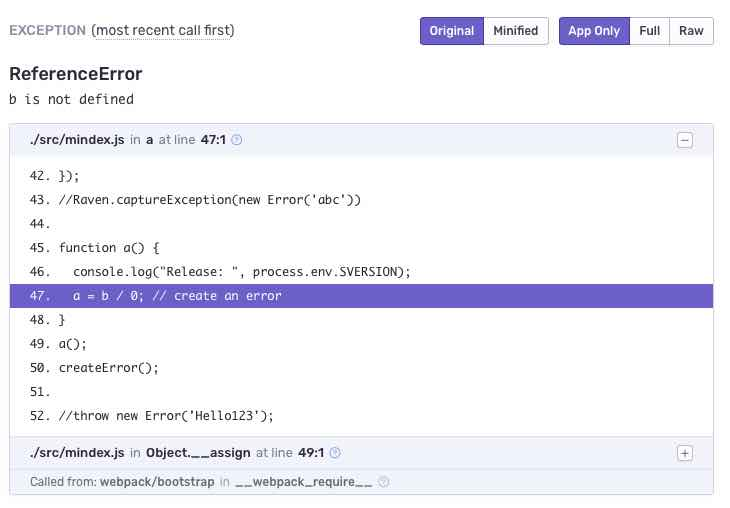

# sentry-node-sourcemap

to bundle and minify, upload source and source map to sentry.io, start test code and create an error:


## setup 

create a `.sentryclirc` file with:
```ini
[defaults]
url=https://sentry.io/
org=XXXXXXXXXX
project=YYYYYY

[auth]
token=zzzzzzzzzzzzz
```

replace DSN with your version
```sh
export DSN=https://XXXXXXXXXXXXXXXXXXXXX@sentry.io/YYYYYYY
```

sentry.io release version
```sh
export SVERSION=release001
```


## build application and upload sourcemaps to sentry.io
```
yarn build
```

```
yarn run v1.10.1
$ webpack && ./sentry-sourcemap-upload.sh
Hash: 86b45174740734569b72
Version: webpack 4.22.0
Time: 616ms
Built at: 22.10.2018 21:44:47
      Asset     Size  Chunks             Chunk Names
    main.js  274 KiB       0  [emitted]  main
main.js.map  333 KiB       0  [emitted]  main
Entrypoint main = main.js main.js.map
 [8] external "domain" 42 bytes {0} [built]
[21] external "fs" 42 bytes {0} [built]
[23] external "http" 42 bytes {0} [built]
[26] external "util" 42 bytes {0} [built]
[27] external "module" 42 bytes {0} [built]
[29] ./src/mindex.js 1.81 KiB {0} [built]
[52] external "https" 42 bytes {0} [built]
[55] external "console" 42 bytes {0} [built]
[59] external "os" 42 bytes {0} [built]
[60] external "url" 42 bytes {0} [built]
[65] external "path" 42 bytes {0} [built]
    + 56 hidden modules
Created release release017.
Finalized release release017.
> Analyzing 2 sources
> Rewriting sources
> Adding source map references
> Validating sources
> Uploading source maps for release release017

Source Map Upload Report
  Scripts
    ~/main.js
  Source Maps
    ~/main.js.map
+---------------+--------------+------------+----------+
| Name          | Distribution | Source Map | Size     |
+---------------+--------------+------------+----------+
| ~/main.js     |              |            | 273.98KB |
| ~/main.js.map |              |            | 332.66KB |
+---------------+--------------+------------+----------+
```

## start the app and simulate an error

```bash
yarn start
```

```
yarn run v1.10.1
$ node dist/main.js
Release:  release017
ReferenceError: b is not defined
    at a (/usr/local/sentry-node/dist/main.js:3314:3)
    at Object.__assign (/usr/local/sentry-node/dist/main.js:3316:1)
    at __webpack_require__ (/usr/local/sentry-node/dist/main.js:20:30)
    at Object.defineProperty.value (/usr/local/sentry-node/dist/main.js:84:18)
    at Object.<anonymous> (/usr/local/sentry-node/dist/main.js:87:10)
    at Module._compile (internal/modules/cjs/loader.js:688:30)
    at Object.Module._extensions..js (internal/modules/cjs/loader.js:699:10)
    at Module.load (internal/modules/cjs/loader.js:598:32)
    at tryModuleLoad (internal/modules/cjs/loader.js:537:12)
    at Function.Module._load (internal/modules/cjs/loader.js:529:3)
    at Function.Module.runMain (internal/modules/cjs/loader.js:741:12)
    at startup (internal/bootstrap/node.js:285:19)
    at bootstrapNodeJSCore (internal/bootstrap/node.js:739:3)
root:  /usr/local/sentry-node/dist/
filename changed: app:///main.js
filename changed: app:///main.js
filename changed: app:///main.js
filename changed: app:///main.js
filename changed: app:///main.js
error Command failed with exit code 1.
info Visit https://yarnpkg.com/en/docs/cli/run for documentation about this command.
```

## peek into source map

```bash
yarn source-map-peek dist/main.js:3314:3
```

```
yarn run v1.10.1
$ source-map-peek dist/main.js:3314:3
Failed to open original source file from webpack:///src/mindex.js ENOENT
file: webpack:///src/mindex.js
line: 55 column: 0
✨  Done in 0.29s.
```

line: 55 should be the line with:
```javascript
a = b / 0; // create an error
```

## source map event on sentry.io

